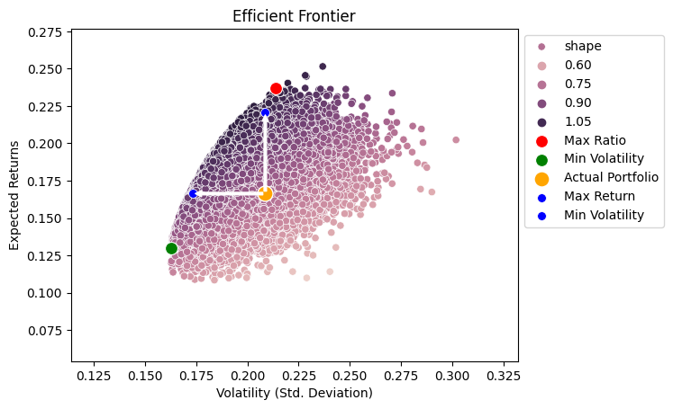

# Portfolio Optimizer

## A fast api to optimize your portfolio  

This API allows users to optimize a portfolio of tickers based on historical data.  
<p align="center">
    
</p>

<p align="center">
  <a href="#Efficient-frontier">Efficient frontier</a> •
  <a href="#how-to-use">How To Use</a> •
  <a href="#API-Endpoints">API Endpoints</a> •
  <a href="#Parameters">Parameters</a> •
  <a href="#Graphs">Graphs</a> •
  <a href="#Dependencies ">Dependencies </a>
</p>

## Efficient frontier

Efficient frontier optimization is a method used in finance to find the optimal portfolio of assets that provides the highest expected return for a given level of risk or the lowest risk for a given level of expected return. It involves calculating the expected returns and covariance matrix of a set of assets, and then finding the set of portfolios that lie on the efficient frontier, which represents the best possible trade-off between expected return and risk. This optimization method can be used to construct portfolios that are well-diversified and optimized for a specific level of risk tolerance or investment objective.


Portfolio Optimizer API  

## How To Use
The API is deployed on render.com, on <a href="https://portfolio-optimizer.onrender.com/">https://portfolio-optimizer.onrender.com/</a> 
  > **Note**
  > Check the status of the API on Render.com by visiting the API's homepage or status page.  
If the API is currently offline or unavailable, wait for it to wake up.
This may take a few minutes or more, depending on the reason for the outage.
Once the API is awake and running, you can start making requests to it as usual.

## API Endpoints  
#### Root  
Endpoint to check if the API is running.  
Request:

```sql
GET /
```

Response:

```json
{
  "message": "Welcome to Portfolio Optimizer!"
}
```

<p align="center">
 
</p>

#### Tickers 

Endpoint to optimize a portfolio of tickers.

Request:

```sql
POST /tickers/
```

#### Parameters

The POST request body is a JSON format with two keys:  

tickers: a list of strings containing the tickers of the assets in the portfolio.  
weights: a list of integers containing the weights of the assets in the portfolio.  

You can test it on the post tab of the api documentation, or using an api client like thunderclient or postman.

<p align="center">
 

</p>
<p align="center">
 
</p>

Response:

If successful, the endpoint returns a JSON object containing the optimized portfolio and URLs to two graphs:

```json
{
    "portfolio": {
        "return": 0.07834263983865495,
        "volatility": 0.10597974076381088,
        "sharpe_ratio": 0.7377197342857546,
        "weights": [
            0.2843565124085234,
            0.2647558605077321,
            0.06261841747241835,
            0.2588443351981374,
            0.1294248744131898
        ]
    },
    "graphs": {
        "efficient_frontier": "/graphs/efficient_frontier.png",
        "weights": "/graphs/optimisation_plot.png"
    }
}
```


If there is an error, the endpoint returns a JSON object with an error message:

- Please remove similar tickers!  
- Please check the sum of weights is equal to 100!  
- Tickers [ticker1, ticker2] do not exist!  
- Not enough historical data for those tickers: [ticker1], please remove them from the tickers list.  

#### Graphs

Endpoint to access static graph files.

Request:

```sql
GET /graphs/efficient_frontier.png
GET /graphs/optimisation_plot.png
```

Response:

A static image file.
<table border="0">
 <tr>
    <td><p style="font-size:1em" align="center">Efficient frontier</b></td>
    <td></td>
 </tr>
 <tr>
    <td><p style="font-size:1em" align="center">Portfolio optimisation</b></td>
    <td></td>
 </tr>
</table>

The efficient frontier graph shows:  

- the position of the actual portfolio in orange,  
- the best return portfolio in red,  
- the minimum risk portfolio in green,  
- the portfolio optimizing the return for the actual risk, in blue (verticla arrow),  
- the porfolio reducing the risk for the actual return, in blue (horizontal arrow).  

The portfolio optimisation graph shows the weights for each portfolio.  

### Dependencies  

- Python 3.8 or higher  
- FastAPI  
- NumPy  
- Pandas  
- SciPy  
- Matplotlib  

---

> GitHub  [Meulemans Philippe](https://github.com/Laverdure77) &nbsp;&middot;&nbsp;
